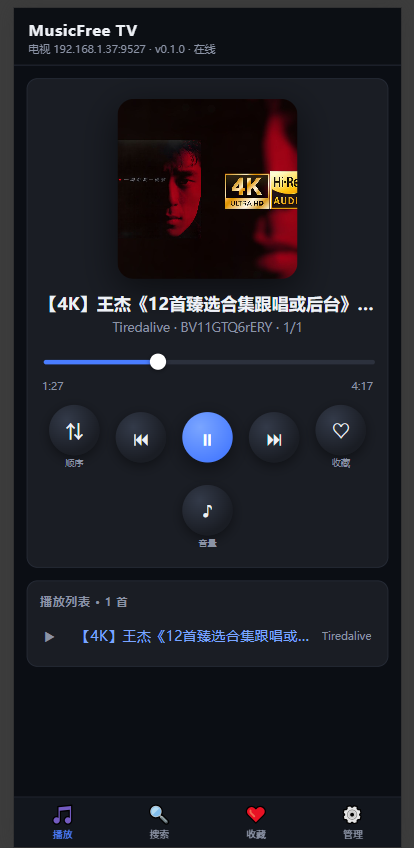

# MusicFree TV（安卓 tv）

基于 [musicfree-plugins](https://github.com/maotoumao/MusicFreePlugins) 插件仓库理念的 **Android TV / 盒子** 播放器（Kotlin + Jetpack Compose for TV + Media3 + QuickJS），支持局域网 **Web 远程控制台**（手机浏览器搜歌/控制/管理插件），已配好 arm64-v8a / x86_64。

> ⚠ 本工程为「可编译骨架 + 全链路功能」：已完整实现 JS 引擎加载、插件调用协议、首页/搜索/歌单/播放器/设置/远程 Web 控制台；搜索支持**多引擎并行 + 渐进式出结果**，插件支持**内容识别安装**（plugins.json / .js 直链），另含通知栏封面、歌词翻译、WebDAV 认证、远程主题/歌词/收藏导出导入等。

---

## 免责声明

本软件不提供任何音乐内容，所有音源均由第三方插件动态获取，内容与版权归原始来源（歌单/站点）所有。请注意：

- 音乐资源来自第三方插件与公开网络，本软件不存储、不上传、不修改任何受版权保护的内容。
- 请遵守所在地法律法规，**切勿将本软件或获取的内容用于任何非法用途**；依 AGPL-3.0 使用本软件请遵循其条款（见 [LICENSE](LICENSE)）。
- 使用本软件所产生的一切后果（包括但不限于版权纠纷、法律风险）由使用者自行承担，作者与贡献者不承担任何责任。
- 若您是版权方并认为本软件被用于侵权用途，请直接向相关插件/站点联系处理。

---

## 目录结构

```
./
├─ app/
│   ├─ build.gradle.kts                         # compileSdk 35 / minSdk 24 / JDK 17
│   ├─ proguard-rules.pro                       # QuickJS / OkHttp / zxing keep rules
│   └─ src/main/
│       ├─ AndroidManifest.xml                  # TV Leanback + 远程配置 intent-filter + 播放服务
│       ├─ assets/runtime/
│       │   ├─ globals.js                       # console / btoa / setTimeout / URL 垫片
│       │   ├─ moduleLoader.js                  # 极简 CommonJS 加载器
│       │   ├─ bootstrap.js                     # env.getUserVariables + __registerPlugin + __invoke RPC + 全局库暴露
│       │   └─ libs/                            # crypto-js / qs / dayjs / he / big-integer / cheerio / webdav / axios
│       ├─ java/com/tvmusic/
│       │   ├─ MainActivity.kt                  # Compose NavHost + 迷你播放条 + 悬浮歌词 + 深链处理
│       │   ├─ core/TvMusicApp.kt               # Application：初始化 Store/Runtime/Repository/Player
│       │   ├─ data/                            # Models.kt + PluginStore.kt（SQLite）
│       │   ├─ runtime/                         # JsEngine 接口 + QuickJsEngine（taoweiji quickjs-android 1.4.6 + native job pump）
│       │   ├─ plugin/                          # PluginRuntime（并行引擎池）+ PluginRepository（订阅/安装/探测 platform）
│       │   ├─ config/                          # SearchSettings（搜索配置：音源优先级/排序/封顶数）
│       │   ├─ player/                          # PlayerManager + PlaybackService（Media3 + MediaSessionService）
│       │   ├─ remote/                          # RemoteConfigService（局域网 HTTP 服务 + Web 控制台，端口 9527）
│       │   └─ ui/
│       │       ├─ theme/Theme.kt + LyricSettings.kt  # 深色 Material3 配色 + 歌词显示配置（默认关闭悬浮）
│       │       ├─ components/Components.kt     # AppTitleBar / LyricOverlay / MediaCard / MusicRow / tvFocus / LoadingBox
│       │       ├─ home/HomeScreen+ViewModel    # 首页：推荐歌单（getRecommendSheetTags）+ 排行榜（getTopLists）
│       │       ├─ search/SearchScreen+ViewModel# 搜索：多音源并行 + 边搜边出 + 音源/时长/封面/排序过滤
│       │       ├─ sheet/SheetScreen+ViewModel  # 歌单详情（musicList / getTopListDetail / importMusicSheet）
│       │       ├─ player/PlayerScreen          # 全屏播放：封面 + 逐行歌词 + 进度 + 控制
│       │       ├─ setting/SettingsScreen+ViewModel # 插件/订阅/用户变量/歌词/远程（地址 + 扫码 + 口令）
│       │       ├─ qr/QrScreen                 # CameraX + zxing 扫码接收
│       │       └─ common/                      # Vms 工厂 + ConfigPending 深链暂存
│       └─ res/                                 # banner / 启动图标(mipmap-*) / colors / themes / network_security_config
├─ gradle/
│   ├─ libs.versions.toml                       # 所有依赖版本（含 quickjs 1.4.6 / media3 1.5.1 / camerax 1.3.4）
│   └─ wrapper/gradle-wrapper.properties        # Gradle 8.10.2
├─ settings.gradle.kts / build.gradle.kts / gradle.properties
└─ README.md
```

---

## 技术要点

### 1. JS 引擎与插件协议（QuickJS + 原生桥）

- **引擎选型**：[taoweiji/quickjs-android](https://github.com/taoweiji/quickjs-android) `1.4.6`（支持 Event Queue、CommonJS、Java→JS 回调），并配套 `cpp/js_job_pump.c` 手动推进 Promise/await 微任务队列（否则插件 async 方法在首个 `await` 处永久挂起）。
- **async RPC**：JS 端 `__invoke(platform, method, argsJson, cbId)` → `Promise.then` → `nativeBridge.onPluginResult(cbId, json)` 回吐；Java 侧用 `CompletableFuture` + 轮询推进 job（超时抛 `PluginCallException`）。
- **并行搜索引擎池**：单 QuickJS 引擎单线程、插件 HTTP 为同步阻塞桥，音源只能逐个搜。`PluginRuntime` 启动 3 台独立引擎（各自 JS 线程 + 独立 runtime，均注册全量插件），搜索按「最空闲引擎」分发实现真并行；播放/详情等仍走主引擎，避免跨引擎状态问题。
- **HTTP 原生桥**：`nativeBridge.httpRequest` → OkHttp 同步请求；自动剥离插件传入的 `Accept-Encoding`，由 OkHttp 透明处理 gzip/br。
- **全局库暴露**：`bootstrap.js` 将 axios/dayjs/he/qs/cheerio/crypto-js/big-integer/webdav 暴露为全局，兼容「裸 `axios.get`」等直接引用库的插件。
- **Parcel 打包兼容**：`__registerPlugin` 自动识别 `module.exports.default` 与普通 CommonJS；平台名取源码**最后一次出现**的 `platform: "..."`（支持字面量与变量引用）。
- **方法缺失处理**：未实现的方法统一返回 `{ __notImplemented: true }`，UI 层静默跳过。

### 2. 插件加载与订阅管理

- **无内置默认订阅源**：不向 APK 写入任何来源地址。订阅源由用户自行添加（设置页 / Web 控制台 `/api/subscriptions`），或放置设备文件 `plugin_sources` 让应用读取。
- **内容识别安装**：`installContent` / `importFromUrl` / `syncOne` 会先判断内容——JSON `plugins` 列表则批量安装，否则按单个 `.js` 插件导入。因此**.js 直链与 plugins.json 均可直接添加并同步**。
- **平台探测**：`PluginRepository.detectPlatform` 支持 `platform: "字面量"` 与 `const X = "..."` + `platform: X` 变量引用，并过滤 `pc / web / WebFilter / H5 / .json` 等干扰项，避免误装。
- **插件元信息**：通过 JS 运行时读取 `platform/version/author/srcUrl/userVariables/supportedSearchType` 存入 `PluginRecord.info`。

### 3. 播放器（Media3 ExoPlayer）

- **PlayerManager**：单例持有 ExoPlayer，对外暴露 `StateFlow<PlayerUiState>`（当前歌曲 / 播放状态 / 队列 / 歌词 / 进度）。
- **按需取流**：播放时调用插件 `getMediaSource(item, "standard")` → `{ url, headers }` → 写入 `DefaultHttpDataSource` 默认请求头（含 Referer 等，HLS 片段同样生效）。
- **队列管理**：歌单全部歌曲作为队列传入 `PlayerManager.play`，支持上/下一首（`skipTo` 重新 fetch URL）。
- **歌词**：`getLyric` 兼容 `{ rawLrc, translation }`、`lyricList`、`translationList`；播放页内嵌逐行歌词，非播放页可有全局悬浮歌词层（**默认关闭**，设置页可开启并调节字号/颜色/位置/透明度）。

### 4. 远程 Web 控制台（端口 9527）

TV 端启动后会在局域网内开启 HTTP 服务，**手机 / PC 浏览器访问电视设置页展示的地址（`http://<电视盒子IP>:9527`）即可远程使用**——搜歌、点播、控制电视端播放、管理插件与订阅、调歌词/主题/搜索偏好，无需遥控器逐键操作。

> 未找到地址时，先回到电视端设置页查看接收地址，确认手机与电视在同一 Wi-Fi/LAN。手机端建议把页面“添加到主屏幕”。

#### 4.1 快速上手

1. 打开控制台 →「管理」页，在「订阅源」粘贴 **plugins.json 或 .js 直链**后点“添加”，再点“立即同步全部订阅”。
2. 在「插件」卡片确认插件已安装（灰点=停用，可点「停用/启用」；「载入失败」表示该插件脚本报错）。
3. 切到「搜索」页，输入关键词，按需勾选下方音源 chips，点“搜索”。
4. 结果列表点歌即**推送到电视端播放**；「全部播放/加入队列」可整页点播。
5. 用「播放」页的控制按钮（播放/暂停、上下首、进度、音量、单曲/顺序/随机）接管电视端播放器。



#### 4.2 页面一览

- **播放**：当前歌曲/封面/歌词、播放进度、循环模式切换，控制按钮直接作用于电视端 ExoPlayer。
- **搜索**：音源多选 chips（顺序按已保存的优先级）、时长过滤、必需封面、结果排序；搜索结果可单点播放或批量入队。
- **收藏**：查看/切换收藏专辑、新建/重命名/删除收藏夹、将当前歌曲收藏到指定收藏夹。
- **管理**：订阅源增删、全部订阅同步、插件启用/停用/卸载、「搜索设置」卡片（见下）、歌词显示调整、主题切换、配置导出/导入。

#### 4.3 搜索设置（音源优先级 + 排序）

「管理 → 搜索设置」卡片可配置，**电视端与搜索页的搜索都采用这里的默认值**：

- **音源优先级**：列表按“搜索顺序 / 结果靠前程度”排列，点 ↑/↓ 调整；**停用或卸载的插件会保留在列表中**（标注“已停用/已卸载”），恢复启用或重装后自动回到原位置；已卸载项可点 ✕ 暂时移出。
- **默认排序 / 升降序 / 最多返回结果**：作用于全局聚合结果。
- 搜索页底部也有同一套排序控件，并提供“存为新默认”把当前页的选择写入后台。

#### 4.4 HTTP API（插件开发 / 自动化可用）

```
GET  /                    → 控制台首页（HTML，含状态/插件/搜索/播放器/收藏/设置）
GET  /api/status          → { app, version, host, port, status }
GET  /api/plugins         → 插件列表（启用状态 / loadError）
POST /api/plugins/toggle、/api/plugins/uninstall
POST /api/subscriptions、/api/subscriptions/remove、/api/sync
GET  /api/search?q=&sources=&minD=&maxD=&art=1&sort=&asc=
     → 渐进式搜索：立即返回会话 id，后台按音源并行搜索
GET  /api/search/poll?id= → 轮询增量结果 { done/totalEnabled, total, results, perSource }
GET  /api/search/config   → 搜索共享配置（音源优先级/默认排序/最大结果数）
POST /api/search/config   → 保存（管理页「搜索设置」卡片）
POST /api/play、/api/play/queue、/api/player/{playpause|next|prev|seek|volume|skip|mode}
GET  /api/player、/api/lyric、/api/themes
POST /api/theme、/api/lyric、/api/export、/api/import
GET  /api/fav/lists、/api/fav/items、/api/player/fav-albums
POST /api/fav/{lists/create|lists/rename|lists/remove|toggle|play}
GET  /api/img?url=...     → 图片代理（绕过图床防盗链，控制台封面可见）
```

搜索说明：`sources`（音源多选，逗号分隔）、`minD`/`maxD`（时长秒）、`art=1`（必须有封面）、`sort/asc`（全局排序）。搜索结果实时刷新，全部音源完成后封顶展示前 `maxTotal` 条。

#### 4.5 深链口令与扫码接收（无需浏览器的配置下发）

```
tvmusic://config?data=<base64url(json)>     # 单条配置
tvmusic://config?sub=<订阅地址>               # 添加订阅
```

深链口令支持 URL-safe Base64 编码；也可在设置页打开「扫码接收」，用 CameraX + zxing 扫描二维码获取配置。

---

## 构建说明

1. 用 **Android Studio 2024.1+** 打开本目录，等待 Gradle Sync（首次约 5–10 分钟）。
2. 连接 Android TV 设备或使用 Android TV Emulator（API 30+）。
3. 点击 ▶ Run 安装运行。

> 注：仅构建 `arm64-v8a` 与 `x86_64` 两种 ABI（见 `app/build.gradle.kts`），覆盖绝大多数电视盒与模拟器。  
> 注：`lint { abortOnError = false }` 与 `buildFeatures { buildConfig = true }` 已开启，命令行可正常构建。

## JDK 17 配置

本工程要求 **JDK 17** 构建（Gradle 8.10.2 运行、`compileOptions` / `kotlinOptions` 均指向 17）。

**方式一（推荐）：Android Studio 内置 JBR**
```
JAVA_HOME=C:\Program Files\Android\Android Studio\jbr
```
或将路径写入 `gradle.properties`：`org.gradle.java.home=C:/Program Files/Android/Android Studio/jbr`

**方式二：独立安装 JDK 17（Temurin / Oracle）**
```
JAVA_HOME=C:\Program Files\Eclipse Adoptium\jdk-17.0.x
```
验证 `java -version` 必须为 `17.x`；`JAVA_HOME` 与 `org.gradle.java.home` 不可同时设置且指向不同版本。

---

## 常用命令（项目根目录）

```bash
# 安装到已连接的 TV 设备
./gradlew :app:installDebug

# 构建 Debug APK（可安装；用于发布版资产）
./gradlew :app:assembleDebug

# 构建 Release APK（本地已配置 keystore.properties 时自动签名）
./gradlew :app:assembleRelease
```

> 发布版（GitHub Release）附带 **已签名的 Release APK**（R8 混淆 + release 证书，可直接安装）。
> Release 签名配置：本机存在 `keystore.properties`（含 `storeFile/storePassword/keyAlias/keyPassword`）与 `keystore/release.jks`，二者均已加入 `.gitignore` 不随仓库分发；克隆者如无该文件，`assembleRelease` 将生成未签名 APK。

---

## 致谢

- [MusicFreePlugins](https://github.com/maotoumao/MusicFreePlugins)（猫头猫）
- [quickjs-android](https://github.com/taoweiji/quickjs-android)（陶维佳）
- [Media3 / ExoPlayer](https://developer.android.com/media/media3)
- [Coil](https://coil-kt.github.io/coil/) / [CameraX](https://developer.android.com/media/camera/camerax) / [zxing](https://github.com/zxing/zxing)

> 本项目由 **opencode**（[https://opencode.ai](https://opencode.ai)）辅助开发与调试。

---

## 开源信息

- **License**：[AGPL-3.0](LICENSE)（GNU Affero General Public License v3.0）。依该许可证可自由使用、研究、修改与分发（含商用），但任何分发版本（含通过网络服务向用户提供交互功能）必须以相同许可公开完整对应源码；分发时请保留版权与出处声明。
- **Copyright**：© 2026 cnliux
- **仓库**：[cnliux/MusicFreeTV](https://github.com/cnliux/MusicFreeTV)
- **反馈**：Bug 或功能建议请到 [Issues](https://github.com/cnliux/MusicFreeTV/issues) 提交，欢迎 PR 贡献代码。