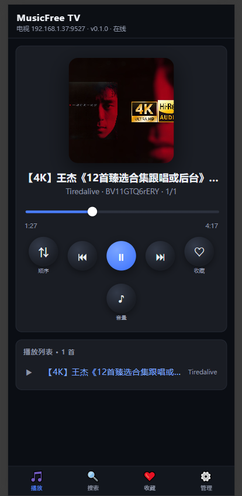

# MusicFreeTV

**Android TV 音乐播放器** —— 让电视变成你的点唱机。

用遥控器在电视上播放多平台音乐，或用**手机浏览器**远程搜歌、点播、控制播放。

[](LICENSE)

---

## 简介

MusicFreeTV 是一个面向 Android TV 的开源音乐播放器应用。安装后可直接连接电视或电视盒子使用，界面为深色 Material3 风格，**所有交互均以遥控器 D-pad 操作为主**，同时提供手机浏览器端远程管理界面。

播放器本身不含任何音源地址，音源以「插件」形式由用户自行添加（JavaScript 插件协议，可批量导入），并支持订阅源自动同步。

### 主要特性

- **多音源聚合播放** —— 通过 QuickJS 插件协议运行各类音乐源插件，支持订阅、启用/停用、备份与迁移。
- **遥控器优先的 TV 界面** —— 首页推荐歌单 / 排行榜、搜索、歌单详情、全屏播放（封面 + 逐行滚动歌词 + 进度）、我的歌单、设置。
- **手机远程控制** —— TV 端在局域网内开一个 Web 控制台（端口 `9527`），手机浏览器打开即可搜歌、点播、收藏、调设置、推送到电视播放。
- **深色 Material3 主题** —— 焦点态、歌词配色、主题切换、封面圆形/方形 + 黑胶旋转等显示项均可配置。
- **歌词与封面兜底** —— 插件不返回歌词或封面时，自动通过 lrc.cx 补全。
- **自动发版** —— 推送到 `main` 分支即由 CI 自动递增版本、打标签、生产签名构建并发布 GitHub Release。
- **安装包轻量** —— 无广告、无账号、无内嵌音源，支持 `arm64-v8a` / `armeabi-v7a` / `x86_64`。

### 远程控制台

TV 端启动后会在局域网内开启 HTTP 服务。在电视端「设置 → 远程管理」查看地址（或扫描页面二维码），手机 / PC 浏览器访问 `http://<电视盒子IP>:9527` 即可使用：

- 播放当前歌曲、歌词、进度、循环模式
- 多音源并行搜索并点歌到电视
- 榜单、推荐歌单浏览，以及整张歌单 / 单曲收藏
- 插件与订阅管理、搜索优先级、歌词显示、主题、待机显示

> 未找到地址时，先回到电视端设置页确认接收地址，并确保手机与电视在同一 Wi-Fi/LAN。
> 控制台**不设访问口令**，仅依赖局域网物理隔离，请勿暴露到公网。
> 建议在手机浏览器中把页面「添加到主屏幕」，获得接近 App 的使用体验。



---

## 环境要求

| 项目 | 要求 |
| --- | --- |
| JDK | **17**（Gradle 8.10.2 运行，`compileOptions` / `kotlinOptions` 均指向 17） |
| Android Gradle Plugin | 见 `gradle/libs.versions.toml` |
| 运行设备 | Android TV 设备或 Android TV 模拟器（API 30+） |
| 签名（仅 Release） | `keystore.properties` + `keystore/release.jks`（仓库不提供） |

---

## 构建

### 1. 配置 JDK 17

**方式一（推荐）：使用 Android Studio 内置 JBR**

```properties
# 写入根目录 gradle.properties
org.gradle.java.home=C:/Program Files/Android/Android Studio/jbr
```

**方式二：独立安装 JDK 17（Temurin / Oracle）**

```properties
org.gradle.java.home=C:/Program Files/Eclipse Adoptium/jdk-17.0.x
```

验证 `java -version` 输出为 `17.x`。`JAVA_HOME` 与 `org.gradle.java.home` 不可同时设置并指向不同版本。

### 2. 用 Android Studio 构建

1. 用 **Android Studio 2024.1+** 打开本目录，等待 Gradle Sync（首次约 5–10 分钟）。
2. 连接 Android TV 设备或启动 Android TV 模拟器（API 30+）。
3. 点击 ▶ Run 安装运行。

### 3. 用命令行构建

```bash
# 构建 Debug APK（产物：app/build/outputs/apk/debug/app-debug.apk）
./gradlew :app:assembleDebug

# 安装到已连接的 TV 设备
./gradlew :app:installDebug

# 构建 Release APK（本地已配置 keystore.properties 时自动签名）
./gradlew :app:assembleRelease
```

Windows 下将 `./gradlew` 换为 `.\gradlew.bat`。

> Release 构建启用严格 Lint（错误会阻断构建）。
> 克隆者若无 `keystore.properties`，`assembleRelease` 生成的是未签名 APK；CI 发布流程则需仓库 Secrets 齐全，否则会失败，以避免误发 Debug 证书产物。
> GitHub Release 附带的 APK 为 **已签名的 Release 包**（R8 混淆 + release 证书），可直接安装。

### 4. 安装到电视

```bash
adb connect <电视盒子IP>:5555
adb install -r app/build/outputs/apk/debug/app-debug.apk
```

> Debug 与 Release 签名不同，**不能互相覆盖安装**。设备上已有另一签名的版本时需先卸载。

### ABI 说明

构建 `arm64-v8a`、`armeabi-v7a` 与 `x86_64` 三种 ABI（见 `app/build.gradle.kts`），覆盖主流电视盒子、32 位旧设备与模拟器。

---

## 文档

| 文档 | 内容 |
| --- | --- |
| [TECHNICAL.md](TECHNICAL.md) | 目录结构、QuickJS 插件协议、播放器实现、远程控制台与 HTTP API、焦点体系、测试与发版踩坑记录 |
| [开源声明 / 关于](https://github.com/cnliux/MusicFreeTV) | 许可、免责与插件来源说明 |

---

## 免责声明

本项目为**个人学习与研究用途**的开源软件，遵循 AGPL-3.0 协议发布。

- 软件仅提供播放框架与界面，**不内置、不分发任何音乐内容或音源地址**。
- 音源、歌词、封面等网络内容均来自用户自行添加的第三方插件，其来源与合法性由使用者自行负责。
- 本项目作者不对任何第三方内容的版权、合法性及使用者据此产生的一切后果承担责任。
- 请勿将本项目用于任何商业或侵权用途；使用者需自行遵守所在地法律法规。

---

## 致谢

- [MusicFreePlugins](https://github.com/maotoumao/MusicFreePlugins)（猫头猫）—— 插件生态
- [quickjs-android](https://github.com/taoweiji/quickjs-android)（陶维佳）—— JS 引擎
- [Media3 / ExoPlayer](https://developer.android.com/media/media3) —— 播放内核
- [Coil](https://coil-kt.github.io/coil/) / [zxing](https://github.com/zxing/zxing)
- [lrc.cx](https://api.lrc.cx) —— 歌词与封面补全
- 感谢 MusicFree 项目及其插件作者社区
- 本项目由 **opencode**（[https://opencode.ai](https://opencode.ai)）辅助开发与调试

---

## 开源信息

- **License**：[AGPL-3.0](LICENSE)（GNU Affero General Public License v3.0）。依该许可证可自由使用、研究、修改与分发（含商用），但任何分发版本（含通过网络服务向用户提供交互功能）必须以相同许可公开完整对应源码；分发时请保留版权与出处声明。
- **Copyright**：© 2026 cnliux
- **仓库**：[cnliux/MusicFreeTV](https://github.com/cnliux/MusicFreeTV)
- **反馈**：Bug 或功能建议请到 [Issues](https://github.com/cnliux/MusicFreeTV/issues) 提交，欢迎 PR 贡献代码。
